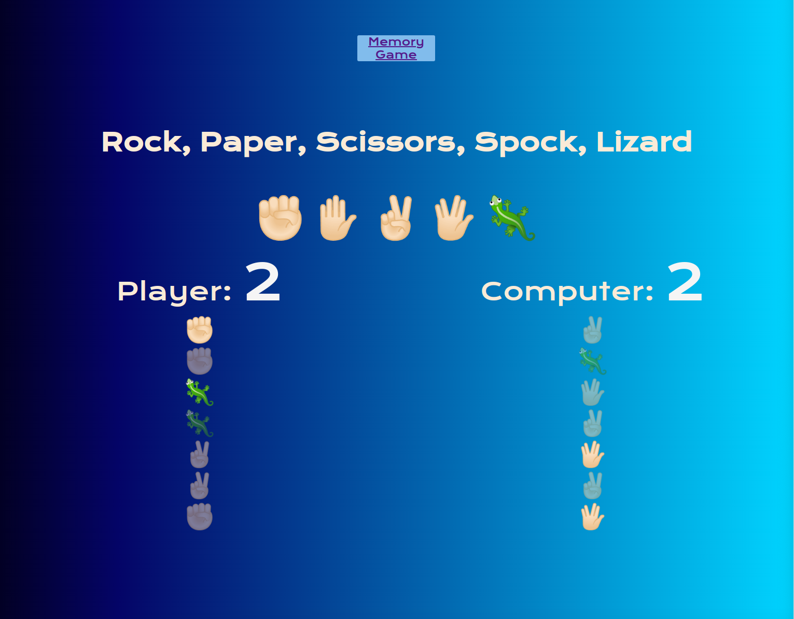
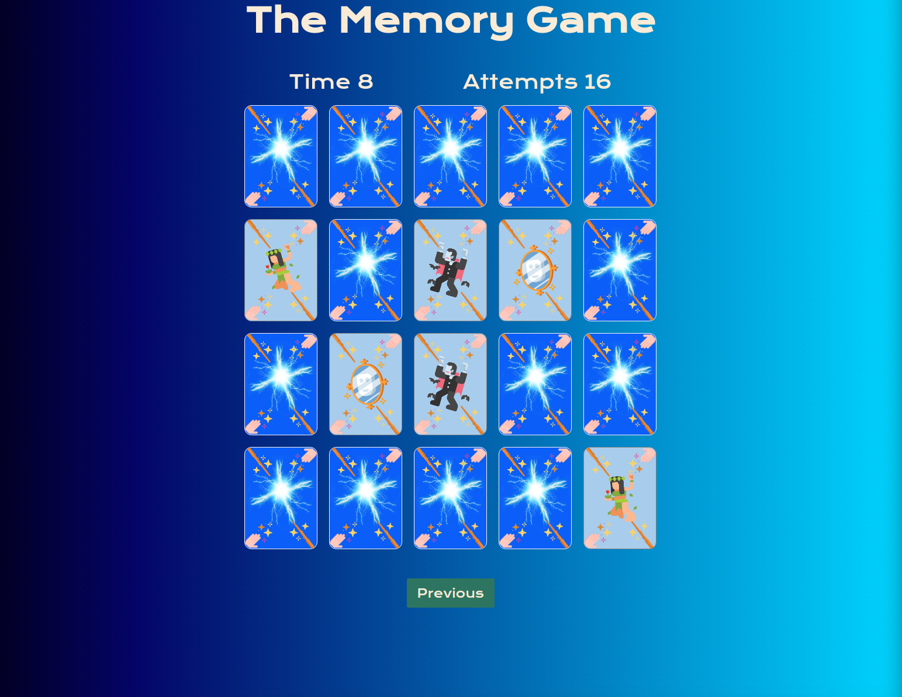

# Javascript-games

## Title: Rock scissors paper

- Repository: `rock-scissors-paper`
- Type of Challenge: `Learning Challenge`
- Duration: take your time
- Deployment strategy : Github page
- Team challenge : `solo`

## Learning objectives
- generate random 
- if statements

## The Mission
Make a rock-scissors-paper game.

### Must-have features
- Have at least three buttons that the player can press to change their pick
- Let the player know they won
- Have a reset button

## Title: Memory game

- Repository: `Memory-game`
- Type of Challenge: `Learning Challenge`
- Duration: take your time
- Deployment strategy: Github page
- Team challenge : `solo

## Learning Objectives
- Change things in the DOM (Aka canvas = cheating)
- Array manipulation

## The project
A recreation of the game `memory`. It is a game where  you have a bunch of cards. Each card contains an image. Of each image there are exactly two cards. The cards are placed in a random order. You get to turn them around. If you turned around two cards they either turn back so you can't see their image if they did not match. And if they did match they stay image face visible.

### Features
- Clicking cards turns them around
- Randomly position the cards
- Readme, but that shouldn't even have to be said
- Explanation on the page itself

The linked games can be found at 
https://chrishargan.github.io/javascript-games/index.html
